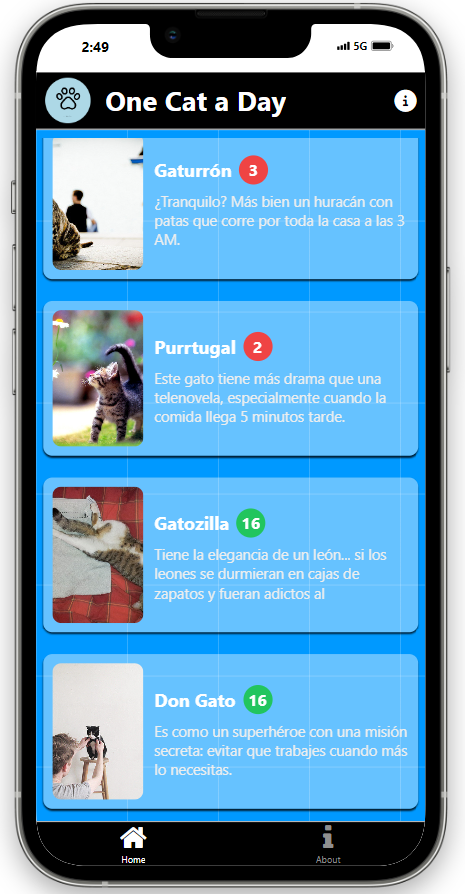

# 🐱 One Cat a Day - React Native App

**One Cat a Day** is a mobile application built with **React Native** and **Expo** that allows users to collect cats by getting a new cat image every day. The app uses [The Cat API](https://thecatapi.com) to fetch random cat images and display them in a list for users to admire.

## 🚀 Features

- 🐾 **Cat Collection**: Users can view a new cat image each day.
- 📅 **Daily Update**: The app automatically updates with a new cat every day.
- 💡 **User-friendly Interface**: Simple and clean interface with a counter showing the number of collected cats.
- ⚙️ **Loading Animation**: Shows a loading spinner while fetching cat data from the API.

## 📱 Screenshots

| Main Screen                | Cat List                     |
| -------------------------- | ---------------------------- |
|  |  |

## 🛠️ Technologies

- **React Native**: Framework to build native apps using JavaScript and React.
- **Expo**: A platform for running and building mobile applications fast.
- **The Cat API**: API to fetch random cat images.
- **FlatList**: Used to display the list of collected cats.
- **ActivityIndicator**: Component to show a loading spinner while fetching data.

## ⚙️ Requirements

- [Node.js](https://nodejs.org/) (v20 or above)
- [Expo CLI](https://docs.expo.dev/get-started/installation/)

## 🚀 Installation and Running the App

Follow these steps to run the app on your local machine:

1. Clone the repository:

   ```bash
   git clone https://github.com/0x10-z/One-Cat-a-Day
   cd one-cat-a-day
   ```

2. Install the dependencies:

   ```bash
   npm install
   ```

3. Start the Expo development server:

   ```bash
   npm run web
   ```

4. Scan the QR code with the Expo Go app on your mobile device or use an Android/iOS emulator to test the app.

## 🌐 API

This app uses **The Cat API** to fetch cat images. You can learn more and get an API key from [The Cat API](https://thecatapi.com/).

### Example API request:

```js
fetch("https://api.thecatapi.com/v1/images/search?limit=1", {
  headers: {
    "x-api-key": "YOUR_API_KEY",
  },
})
  .then((response) => response.json())
  .then((data) => console.log(data))
  .catch((error) => console.error("Error:", error));
```

## 📂 Project Structure

```
.
├── assets                 # Images, fonts, etc.
├── components             # Reusable components like CatCard and Logo
├── lib                    # API logic and data handling
├── App.js                 # Main app file
├── README.md              # Project README file
└── package.json           # Project metadata and dependencies
```

## Deploy to Google Play

Prepare your private key `gplay_priv.json` file.

```
npm install -g eas-cli && eas login
```

Build

```
eas build:configure

```

---

Thank you for using **One Cat a Day**! 😻
